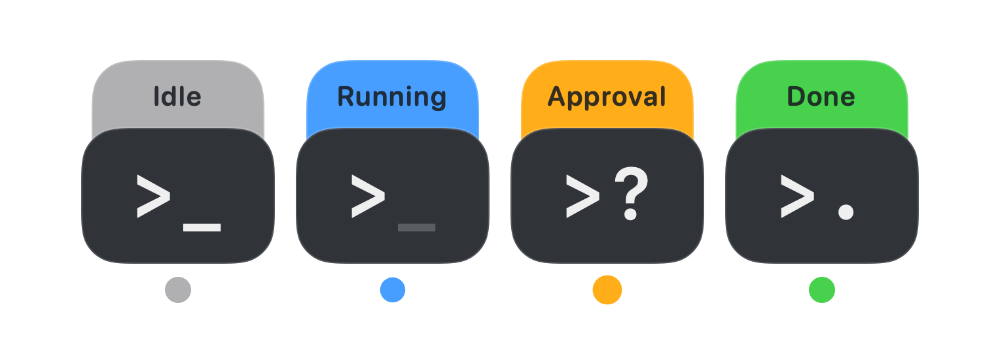

# Signal Monitor

Signal Monitor is a small, native macOS companion for Codex. It keeps the tasks you care about visible as compact floating cards, so running, waiting, completed, and idle states can be read without reopening the Codex sidebar.

The app is free and local-first. It has no account, analytics, ads, or cloud service of its own. Signal Monitor is an independent community project and is not affiliated with or endorsed by OpenAI.



## What it does

- Shows selected Codex tasks in a floating grid, configurable up to 6 rows × 8 columns.
- Uses opaque gray, blue, amber, and green cards for idle, running, waiting/blocked, and completed states.
- Opens the corresponding task in Codex when a card or menu row is clicked.
- Supports local nicknames and manual ordering for focused tasks.
- Keeps the grid within the screen with native movement animations; Return saves a nickname and ends editing.
- Sorts unselected tasks by creation time or most recent task start.
- Discovers newly created and removed tasks automatically; the menu also includes a manual refresh.
- Includes English and Simplified Chinese UI, Launch at Login, a confirmed **Reset Settings…** action, and a privacy-safe diagnostics report.

## Current experience and limitations

Signal Monitor works best as an at-a-glance companion, rather than an authoritative real-time event stream. Task start, stop, completion, and task-list changes normally update automatically. Once Codex has recorded a lifecycle event locally, an active task is usually reflected within about 0.75–1.5 seconds; idle polling can take up to about 2 seconds.

Approval-state display latency is the main current limitation. For command, file-edit, and Computer Use approvals, the card may remain blue until the approval event becomes readable locally. If that event arrives late, amber may appear only after **Allow** is clicked; clearing amber after approval can also be delayed. Treat the indicator as a delayed status display, not an immediate approval notification.

## Requirements

- macOS 13 or later on Apple silicon or Intel.
- The Codex desktop app or Codex CLI installed locally, plus a local Node.js runtime. The app discovers the runtime bundled with the desktop app and common Homebrew locations automatically.

## Download

[Download Signal Monitor 0.1.2 for macOS](https://github.com/cylmio/signal-monitor/releases/download/v0.1.2/Signal-Monitor-0.1.2.dmg). The Universal app supports Apple silicon and Intel, is Developer ID signed, and is notarized by Apple.

Open the DMG, drag **Signal Monitor** to **Applications**, and launch it. When updating, quit the previous version before replacing it. Open **Manage Focus…** from the menu-bar terminal icon and select tasks, set the grid size, and optionally edit nicknames or reorder tasks.

This is still an early preview; please read the approval-display limitations above. See [release notes](https://github.com/cylmio/signal-monitor/releases/tag/v0.1.2) for changes and the download checksum.

No Hook installation is required for normal live status. An optional Hook integration is available from the menu to supplement waiting-for-input signals on compatible Codex sessions. If enabled, Signal Monitor merges its entries into `~/.codex/hooks.json`, preserves unrelated hooks, and creates a timestamped backup before each change.

## Status language

- Gray: idle or offline.
- Breathing blue: running.
- Double-pulse amber: waiting for input, a detected command/file approval, or blocked.
- Green with `>.`: completed and not yet reviewed. It stays green until the task card or its menu row is clicked; opening the task marks that completion as read and returns it to gray.

Stopping or aborting a task manually returns it directly to gray. Starting a new turn returns the card to blue, even if an earlier completion was already acknowledged.

## Why approval timing varies

Task discovery comes from the local Codex task index. Running, completion, and interruption states are derived from lifecycle markers in Codex's local rollout logs. Detected command and file-edit approval state is derived from privacy-filtered local log metadata: only a task identifier and event category leave the database query, never the command or tool body. Task content is not copied into Signal Monitor's event store. The bridge polls adaptively (faster while tasks are active, slower while idle) and does not start an additional Codex App Server. The optional Hook provides supplemental signals. Users do not need to run scripts manually.

Codex currently does not expose every approval surface through one immediate lifecycle signal. Some request and resolution metadata is written to the local data sources later or in batches. Signal Monitor cannot show a transition until that metadata becomes readable; once it is readable, the remaining delay comes from the adaptive bridge poll and the app's file-change fallback.

Signal Monitor currently depends on local Codex data formats and integration surfaces that may change between Codex releases. If an update breaks task discovery or status detection, please open an issue with the app and Codex versions plus the privacy-safe diagnostics report.

## Troubleshooting

- Choose **Refresh task list** after creating or archiving a task if it has not appeared yet.
- Open **Diagnostics…** first if state changes are missing. The optional Hook is a supplemental fallback, not a requirement.
- Open **Diagnostics…** to check the Codex and Node runtimes, hook installation, bridge process, snapshot age, and recent bridge log. The copied report excludes task titles, prompts, code, and full home paths.
- If Codex was updated or moved, quit and reopen both Codex and Signal Monitor.
- Choose **Reset Settings…** to restore the default focus list, nicknames, language, orientation, sorting, panel position, and completion acknowledgements. Hook integration and Launch at Login are intentionally preserved.

To remove the integration while keeping the app, choose **Optional Hook Integration… → Remove Integration**. To remove all local app data after quitting, delete `~/Library/Application Support/Signal Monitor` and the app's macOS preferences. See [PRIVACY.md](PRIVACY.md) for the exact data boundary.

## Build from source

```sh
git clone https://github.com/cylmio/signal-monitor.git
cd signal-monitor
swift test
python3 scripts/verify_bridge.py
zsh scripts/package_app.sh
open "dist/Signal Monitor.app"
```

The package script produces a Universal app containing arm64 and x86_64 code. Creating a signed and notarized DMG requires a Developer ID Application certificate and a `notarytool` keychain profile:

```sh
export SIGNAL_MONITOR_SIGN_IDENTITY="Developer ID Application: Example (TEAMID)"
export SIGNAL_MONITOR_NOTARY_PROFILE="signal-monitor-notary"
zsh scripts/release_dmg.sh
```

Secrets are read from the login keychain through the named notary profile and are never stored in this repository.

## Distribution note

The free GitHub DMG uses a local Node.js bridge and offers optional user-approved hooks. A separate [sandboxed Mac App Store target](AppStore/README.md) is included in the same open-source repository: it reads a user-selected Codex data folder natively, without Node.js or hooks. Signal Monitor for codex is also available on the Mac App Store. The editions share the floating-card UI but have different integration and permission models.

Signal Monitor is licensed under the [MIT License](LICENSE). Contributions are described in [CONTRIBUTING.md](CONTRIBUTING.md).
